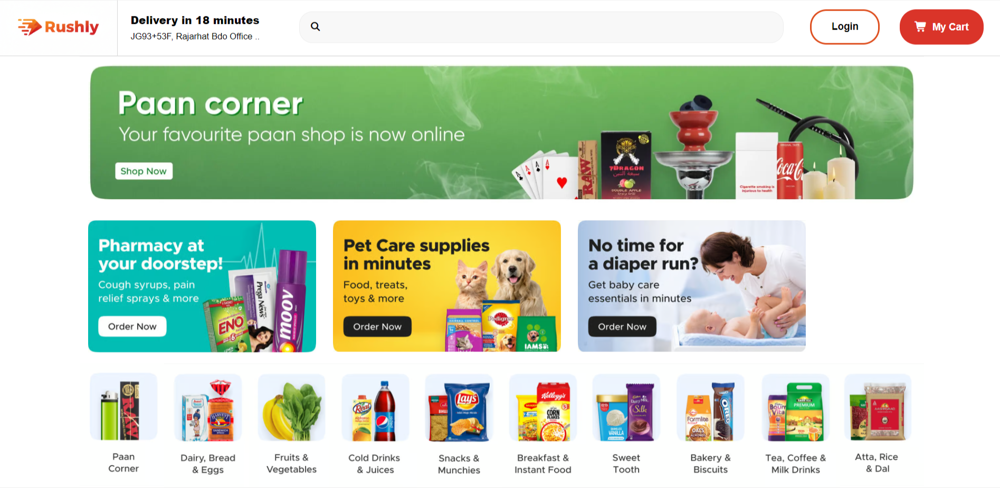

# Rushly ⚡  
### Quick Commerce Landing Page

Rushly is a responsive **quick commerce landing page** built using **HTML and CSS**, designed to showcase a fast, modern, and user-friendly shopping experience.  
This project is **frontend-only** and focuses on clean UI, layout structure, and responsiveness across devices.
---

## 🚀 Live Demo
🔗 https://joydeep-devx.github.io/quick-commerce-landing-page/

---

## 📸 Preview
### Desktop View


### Mobile View

---

## 🛠️ Tech Stack
- HTML5  
- CSS3  
- Flexbox  
- CSS Grid  
- Media Queries  
---

## ✨ Features
- Responsive landing page layout  
- Mobile-first design approach  
- Clean and modern UI  
- Well-structured HTML  
- Separate CSS files for base styles and responsiveness  
- Organized assets and project structure  

---

## 📂 Project Structure
```
quick-commerce-landing-page/
├── index.html
├── css/
│   ├── style.css
│   └── media.css
├── assets
└── README.md
```
---

## 🎯 Learning Outcomes
- Better understanding of responsive layouts  
- Practical usage of Flexbox and Grid  
- Improved CSS organization and scalability  
- Experience hosting projects using GitHub Pages
---

## 📌 Future Improvements
- Add animations and micro-interactions  
- Improve accessibility and semantic HTML  
- Add JavaScript for interactivity  
- Expand into a multi-page layout  
---

## 🙌 Acknowledgements
This project is part of my web development learning journey, focused on strengthening frontend fundamentals.

Feedback and suggestions are always welcome!
---

## 📬 Connect With Me
- GitHub: https://github.com/joydeep-devx  
- LinkedIn: https://www.linkedin.com/in/joydeep-saha-1a67b3354/
